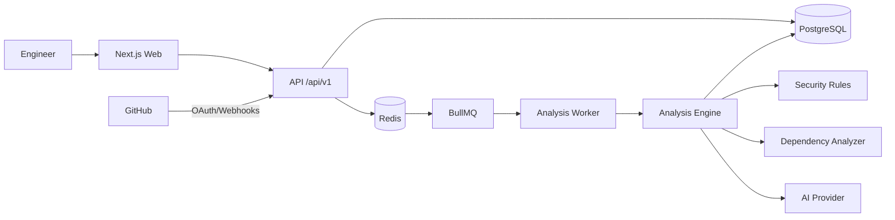
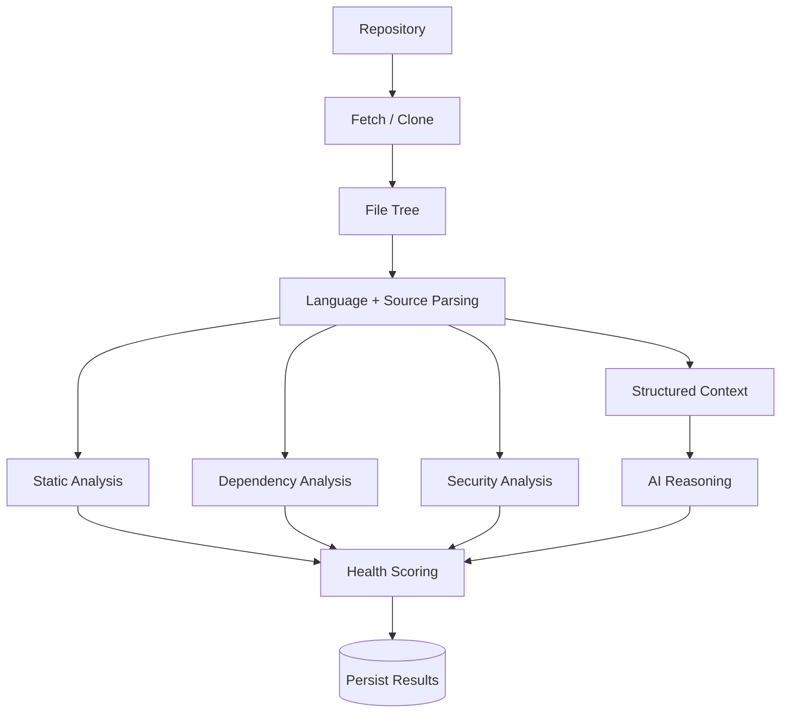

# NEXUS — AI-Powered Engineering Intelligence

> Understand your codebase before it becomes a problem.

NEXUS is a production-oriented engineering intelligence platform that connects to GitHub, analyzes repositories, correlates static/security/dependency signals, and turns evidence into prioritized engineering actions.

## Why this project is interview-grade

This repository intentionally demonstrates more than a dashboard:
- TypeScript monorepo with separate web/API/worker boundaries
- PostgreSQL + Prisma relational model
- Redis/BullMQ background analysis architecture
- GitHub OAuth/webhook integration boundaries
- Deterministic, explainable repository-health scoring
- Evidence-based security rules with confidence levels
- Structured AI provider abstraction with schema validation
- Demo mode that works without GitHub credentials
- API versioning, validation, audit logs, health/readiness endpoints
- Docker Compose, CI, tests, accessibility, responsive UI
- Mermaid architecture and data-flow diagrams

The supplied product specification is the source of truth for the architecture and product scope. fileciteturn0file0L21-L59

## 5-minute recruiter path

1. Open `/` for the product story.
2. Select **Enter Demo**.
3. Inspect repository health, risk files, security findings and technical debt.
4. Open PR Intelligence.
5. Ask NEXUS AI a repository-specific question.
6. Inspect the source architecture and worker pipeline.

Demo data is explicitly synthetic and is never presented as a real external security scan.

## Architecture



## Repository analysis pipeline



## AI architecture

The AI layer consumes structured repository evidence instead of blindly sending an entire repository to an LLM. Provider output is schema-validated before it becomes an application insight. The specification explicitly requires this boundary. fileciteturn0file0L390-L436

## Security model

- Backend authorization is authoritative.
- OAuth tokens never enter frontend responses.
- Webhook signatures are verified before enqueueing work.
- Secrets are excluded from logs.
- Input DTOs are validated.
- Rate limiting/CORS/security headers are represented in the API boundary.
- Security findings include severity, confidence, evidence and remediation rather than invented CVEs.

## Local development

```bash
cp .env.example .env
docker compose up -d postgres redis
pnpm install
pnpm db:generate
pnpm dev
```

Web: `http://localhost:3000`  
API: `http://localhost:4000/api/v1`  
Swagger: `http://localhost:4000/api/v1/docs`

## Deployment

The web app is Vercel-compatible. API and worker are Docker-compatible. PostgreSQL and Redis can be supplied by managed providers. No provider is hard-coded.

## Testing

```bash
pnpm lint
pnpm typecheck
pnpm test
pnpm build
```

## Engineering decisions

**Why deterministic scoring?** A health score must be explainable. NEXUS weights observable signals such as complexity, security findings, dependency freshness and repository activity.

**Why queues?** Repository analysis is bursty and CPU/network-heavy. BullMQ isolates long-running work from request latency.

**Why an AI provider interface?** Local/mock development must work without an API key, while production can use an OpenAI-compatible provider.

**Why demo mode?** A recruiter should understand the product without granting GitHub access, matching the product requirement. fileciteturn0file0L1032-L1063

## Known limitations

- GitHub OAuth requires real app credentials.
- Dependency vulnerability lookups are intentionally adapter-based; no CVEs are fabricated.
- The local analyzer is deliberately conservative and heuristic.
- Production deployment still needs provider-specific secret configuration and migrations.

## Roadmap

- Tree-sitter parsers for deeper multi-language AST intelligence
- OSV/GitHub Advisory adapter
- OpenTelemetry traces
- Organization-level engineering benchmarks
- Pull-request checks/bot integration
- Usage metering and billing provider integration

## License

MIT.
