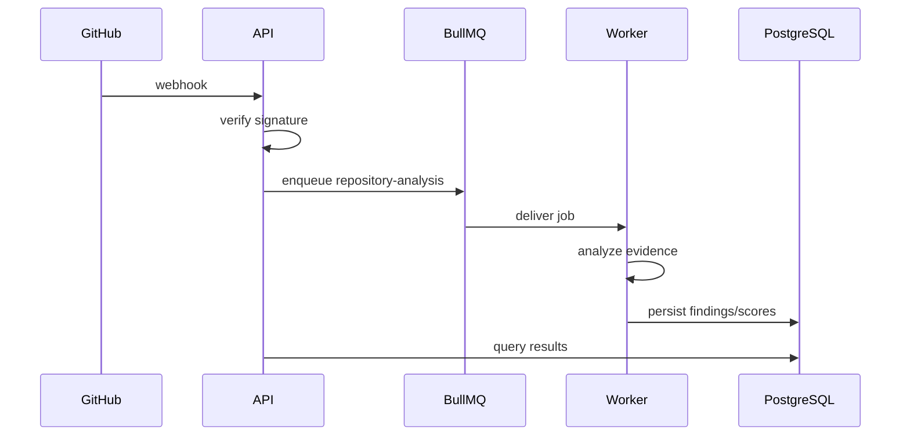

# Architecture Notes

## Boundaries

**Web** owns presentation and interaction.  
**API** owns authorization, validation, orchestration and HTTP contracts.  
**Worker** owns asynchronous analysis.  
**Packages** own shared types/configuration.

## Analysis jobs

## Health score

The score is a weighted aggregation of six dimensions. Every dimension is derived from explicit signals; the UI labels heuristic estimates as heuristic. This follows the specification's requirement for explainable inputs rather than meaningless random scores. fileciteturn0file0L437-L462
